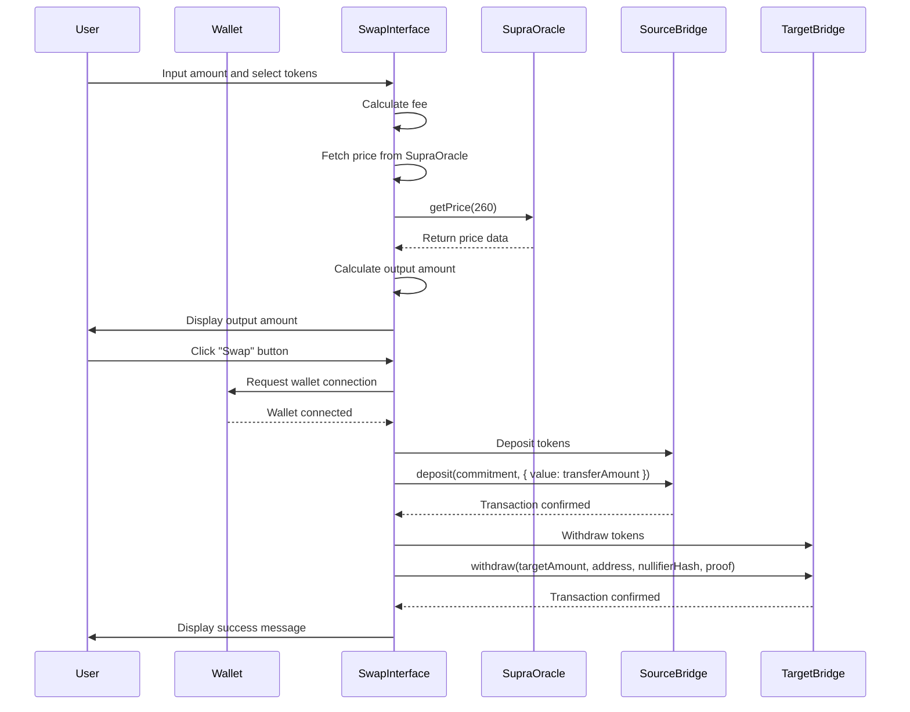

# NeoX - Cross-Chain Token Bridge

## Overview

NeoX is a decentralized application (dApp) that allows users to seamlessly swap tokens across multiple blockchains. With a focus on security and user experience, NeoX leverages Zero-Knowledge Proofs (ZKPs) to ensure that transactions are both private and verifiable.

## Features

- **Cross-Chain Swapping**: Easily swap tokens between supported blockchains.
- **Zero-Knowledge Proofs**: Enhanced privacy and security for transactions.
- **Staking**: Earn up to 12% APY by staking your tokens.
- **User-Friendly Interface**: Intuitive design for a smooth user experience.

## Technologies Used

- **React**: Frontend framework for building the user interface.
- **Zero-Knowledge Proofs (ZKPs)**: A cryptographic method used to enhance privacy and security in transactions. ZKPs allow one party to prove to another that a statement is true without revealing any additional information. In NeoX, ZKPs are used to ensure that token swaps are secure and private.
- **Ethers.js**: Library for interacting with the Ethereum blockchain.
- **Styled Components**: For styling React components.
- **Hardhat**: Development environment for Ethereum smart contracts.

## Getting Started

### Prerequisites

- Node.js (v14 or higher)
- npm (Node Package Manager)

### Installation

1. Clone the repository:

   ```bash
   git clone https://github.com/yourusername/neox.git
   cd neox
   ```

2. Install the dependencies:

   ```bash
   npm install
   ```

3. Set up your environment variables:

   Create a `.env` file in the root directory and add the following:

   ```plaintext
   PRIVATE_KEY=your_private_key
   SEPOLIA_RPC_URL=https://sepolia.infura.io/v3/your_infura_project_id
   BASE_SEPOLIA_RPC_URL=https://base-sepolia.infura.io/v3/your_infura_project_id
   SEPOLIA_BRIDGE_ADDRESS=your_sepolia_bridge_address
   NEOX_MAINNET_BRIDGE_ADDRESS=your_neox_bridge_address
   ETHERSCAN_API_KEY=your_etherscan_api_key
   BASESCAN_API_KEY=your_basescan_api_key
   ```

      ```plaintext
   Smart Contract Address Bridge: 0xa8463795fAEfb6004Ce97115f335A201e133C567
   Smart Contract Address SupraOracle: 0x938526421BB64E63b34f814Ae82BBE018e9A110B
   Smart Contract Address Prover: 0x216D043aB1e57180157fDAD7629651CD60a38bD0

   NeoX Explorer: https://xexplorer.neo.org/address/0xa8463795fAEfb6004Ce97115f335A201e133C567?tab=contract
   NeoX Explorer: https://xexplorer.neo.org/address/0x938526421BB64E63b34f814Ae82BBE018e9A110B?tab=contract
   NeoX Explorer: https://xexplorer.neo.org/address/0x216D043aB1e57180157fDAD7629651CD60a38bD0?tab=contract
   ```

### Running the Application

1. Start the development server:

   ```bash
   npm start
   ```

2. Open your browser and navigate to `http://localhost:3000` or `https://neox.thedrop.top`

## 🚨 Important Information 🚨

**When testing the bridge and swapping tokens, please make sure that the contract bridge has enough balance to cover the transaction amount, otherwise you will get an error alert and failing transaction.**

**Currently the bridge is using the SupraOracle to get the price of tokens, however when we swap 1ETH to GAS we actually calculate the GAS-USDT price, so consider 1ETH to be 1USDT for the purpose of this hackathon.**
**The Oracle SC used is 0x58e158c74DF7Ad6396C0dcbadc4878faC9e93d57 and Pair ID is 260.**

## Usage

1. Connect your wallet (e.g., MetaMask).
2. Select the tokens you want to swap.
3. Enter the amount you wish to swap.
4. Click on the "Swap" button to initiate the transaction.
5. Optionally, stake your tokens to earn APY.

## Testing

To run tests, use the following command:

```bash
npx hardhat test
```

## Deployment

To deploy the smart contracts, use:

```bash
npx hardhat run scripts/deploy.js --network sepolia
npx hardhat run scripts/deploy.js --network neoxMainnet
```

## Contributing 

Contributions are welcome! Please follow these steps:

1. Fork the repository.
2. Create a new branch (`git checkout -b feature/YourFeature`).
3. Make your changes and commit them (`git commit -m 'Add some feature'`).
4. Push to the branch (`git push origin feature/YourFeature`).
5. Open a pull request.

# Token Swap Process

This section describes the process of swapping tokens between different chains using our application.

## Sequence Diagram

## Roadmap 🗺️

1. **Cross-Chain Integration** : Add support for additional blockchains to broaden token swapping capabilities.
2. **Enhanced Staking Features**: Introduce new staking options and yield farming opportunities to incentivize user engagement and liquidity provision.
3. **Educational Initiatives** : Create tutorials and guides to help users understand how to use the platform and the benefits of using ZKPs in DeFi.
4. **Partnerships with DeFi Projects** : Collaborate with other DeFi projects to create synergies and enhance the platform's offerings.

## Business model 📈

- **Staking Rewards** : Users can provide liquidity to the bridge by staking their tokens in the bridge, thus they can earn rewards every time a transaction is made. The rewards are made from the transaction fees.
- **Transaction Fees** : Users pay a fee for each transaction made through the bridge.

## License

This project is licensed under the MIT License - see the [LICENSE](LICENSE) file for details.

